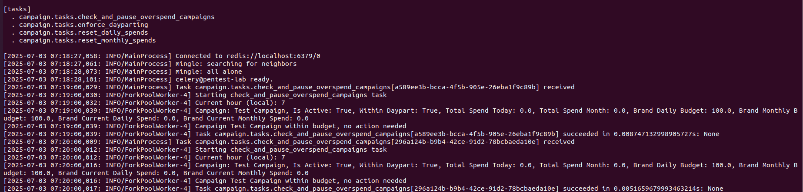
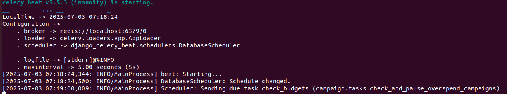
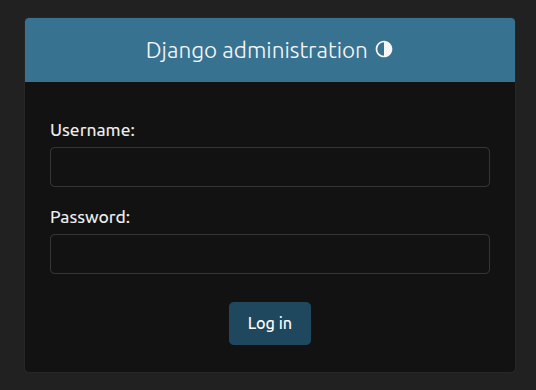
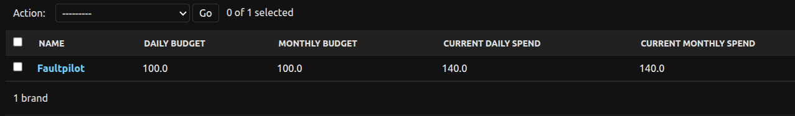
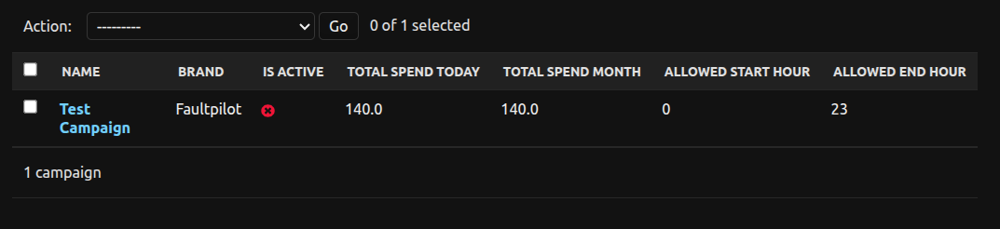
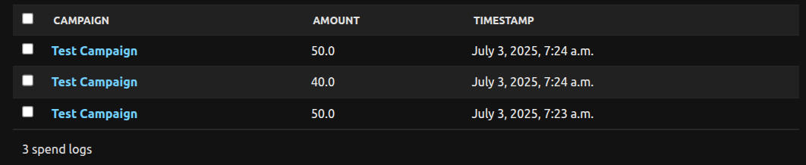

# Ad Agency Budget Management System

## Overview
This Django and Celery-based backend system powers an advertising agency’s budget management with precision and scalability. It tracks daily and monthly ad spends, enforces budget limits, adheres to dayparting schedules, and automates budget resets. Built with static typing using Python type hints and verified by MyPy, the system ensures code quality and maintainability, making it production-ready for an ad agency.

## Features

- Budget Tracking: Accurately monitors daily and monthly spends for brands and campaigns.
- Budget Enforcement: Automatically pauses campaigns when budgets are exceeded.
- Dayparting: Activates/deactivates campaigns based on predefined hourly schedules.
- Periodic Resets: Resets spends daily and monthly, reactivating eligible campaigns.
- Admin Interface: Provides a user-friendly Django admin panel for managing data.
- Type Safety: Enforces strict typing with MyPy for robust, error-free code.

## Setup Instructions
Follow these steps to set up and run the project locally:

Clone the Repository
- git clone git@github.com:Brandonawan/django-campaign-budget-manager.git
- cd django-campaign-budget-manager

Create and Activate Virtual Environment
- python -m venv env
- source env/bin/activate  # on linux

## Install Dependencies
- Ensure Python 3.8+ is installed, then:
- pip install -r requirements.txt

## Install Redis
Redis is required as the Celery message broker:

- macOS: brew install redis
- Linux: sudo apt-get install redis-server
- Windows: Download from https://redis.io/download

## Start Redis:
- redis-server

## Apply Database Migrations
Using SQLite for simplicity:
- python manage.py makemigrations
- python manage.py migrate

## Run Django Development Server
- python manage.py runserver

## Start Celery Worker
In a separate terminal:
- celery -A ad_system worker --loglevel=info

## Start Celery Beat Scheduler
In another terminal, for periodic tasks:
- celery -A ad_system beat --loglevel=info

## Create Admin Superuser
To access the admin panel, on the terminal:
- python manage.py createsuperuser

- On your browser Access at http://localhost:8000/admin.

## Sample screenshots of admin dashboard

- As seen above the campaig is overspend pass budget hence it's deactivate and the red cross sign to indicate that.

## Verify Type Correctness
Run MyPy to ensure no type errors:
- mypy .

## Requirements

- Python: 3.8 or higher
- Django: 4.x
- Celery: 5.x
- django-celery-beat: 2.4 or higher
- Redis: 4.0 or higher
- MyPy: 1.0 or higher

## Data Models
The system uses three core models in campaign/models.py:

### Brand

- name: str – Brand name.
- daily_budget: float – Maximum daily ad spend.
- monthly_budget: float – Maximum monthly ad spend.
- current_daily_spend: float – Total daily spend across campaigns.
- current_monthly_spend: float – Total monthly spend across campaigns.
- Relationship: One-to-many with Campaign.

### Campaign

- name: str – Campaign name.
- brand: Brand – ForeignKey to Brand.
- is_active: bool – Indicates if the campaign is running.
- total_spend_today: float – Campaign’s daily spend.
- total_spend_month: float – Campaign’s monthly spend.
- allowed_start_hour: int – Start hour (0-23) for dayparting.
- allowed_end_hour: int – End hour (0-23) for dayparting.
- Relationships: Many-to-one with Brand; one-to-many with SpendLog.

### SpendLog

- campaign: Campaign – ForeignKey to Campaign.
- amount: float – Spend amount for a transaction.
- timestamp: datetime – When the spend occurred.
- Relationship: Many-to-one with Campaign.

### Relationships:

- A Brand has multiple Campaigns.
- A Campaign has multiple SpendLogs.
- Creating a SpendLog updates Campaign and Brand spend fields atomically.

## Daily Workflow

### Testing Instructions
Use the Django admin panel at http://localhost:8000/admin to test the system:

#### Create a Brand:

- Navigate to Brands > Add Brand.
- Enter:
- Name: e.g., "Brand A"
- Daily Budget: e.g., 1000.00
- Monthly Budget: e.g., 30000.00
- Save.

#### Create a Campaign:

- Navigate to Campaigns > Add Campaign.
- Enter:
- Name: e.g., "Summer Campaign"
- Brand: Select "Brand A".
- Is Active: Check (True).
- Allowed Start Hour: e.g., 8 (8 AM).(optional, can be left empty)
- Allowed End Hour: e.g., 20 (8 PM). (optional, can be left empty) 
- Save.

##### Create SpendLog Entries:

- Navigate to Spend Logs > Add Spend Log.
- Enter:
- Campaign: Select "Summer Campaign".
- Amount: e.g., 500.00
- Save.
Verify:
- Check Campaign: total_spend_today and total_spend_month should increase by 500.00.
- Check Brand: current_daily_spend and current_monthly_spend should increase by 500.00.

#### Test Budget Enforcement:

- Add another SpendLog with Amount: 600.00 (total 1100.00, exceeding daily_budget of 1000.00).
- Wait 2 minutes for check_and_pause_overspend_campaigns to run.
Verify:
- Check Campaign: is_active should be False because:
- Campaign.total_spend_today (1100.00) >= Brand.daily_budget (1000.00)

- Monitor Celery logs:celery -A ad_agency worker --loglevel=info

- Look for: Pausing campaign Summer Campaign due to budget overrun.

#### Test Dayparting:

- Edit Campaign to set allowed_start_hour=10 and allowed_end_hour=12 (outside current hour, e.g., 8 AM).
- Wait for the hourly enforce_dayparting task.
- Verify:
- Check Campaign: is_active should be False if outside [10, 12].
- Monitor Celery logs for: Deactivated campaign Summer Campaign.

#### Test Resets:

Daily Reset:
- Wait until midnight or manually trigger:python manage.py shell
>>> from campaign.tasks import reset_daily_spends
>>> reset_daily_spends()

- Verify: Campaign.total_spend_today and Brand.current_daily_spend reset to 0; is_active updated per dayparting and monthly budgets.

- Monthly Reset:
Set system date to 1st or trigger:>>> from campaign.tasks import reset_monthly_spends
>>> reset_monthly_spends()

- Verify: Campaign.total_spend_month and Brand.current_monthly_spend reset to 0.

### Verify Type Correctness:

Run:
- mypy .

- Verify: No type errors, confirming type safety.

### Conditions for Pausing a Campaign
- A campaign’s is_active is set to False by the check_and_pause_overspend_campaigns task (every 5 minutes) if any of these conditions are met:

- Campaign.total_spend_today >= Brand.daily_budget
- Campaign.total_spend_month >= Brand.monthly_budget
- Brand.current_daily_spend >= Brand.daily_budget
- Brand.current_monthly_spend >= Brand.monthly_budget
- The current hour is outside [allowed_start_hour, allowed_end_hour] (checked hourly by enforce_dayparting).

### Assumptions and Simplifications

- Database: Uses SQLite for simplicity in development; Postgres is supported with configuration.
- Spend Logging: Assumes spends are logged via SpendLog creation in the admin panel or future API.
- Currency: All monetary values are in USD for consistency.
- Dayparting: Uses 24-hour format; campaigns run within a single day’s schedule, based on server timezone (Africa/Lagos).
Task Frequency:
- Budget checks: Every 1 minutes.
- Dayparting: Hourly.
- Resets: Midnight (daily) and 1st of month (monthly).

Timezone: Set to Africa/Lagos for Django and Celery.
- Concurrency: Uses database transactions to prevent race conditions.
- Libraries: Relies solely on Celery and Redis, per requirements.

### GitHub Repository
[Insert your public GitHub repository link here]

### Code Quality

- Static Typing: Uses Python type hints with MyPy (mypy.ini enforces strict rules), ensuring zero type errors.
- Logging: Detailed logging in Celery tasks for debugging and monitoring.
- Atomicity: Database transactions ensure consistent spend updates.
- Extensibility: Modular design supports future enhancements like APIs or admin actions.
